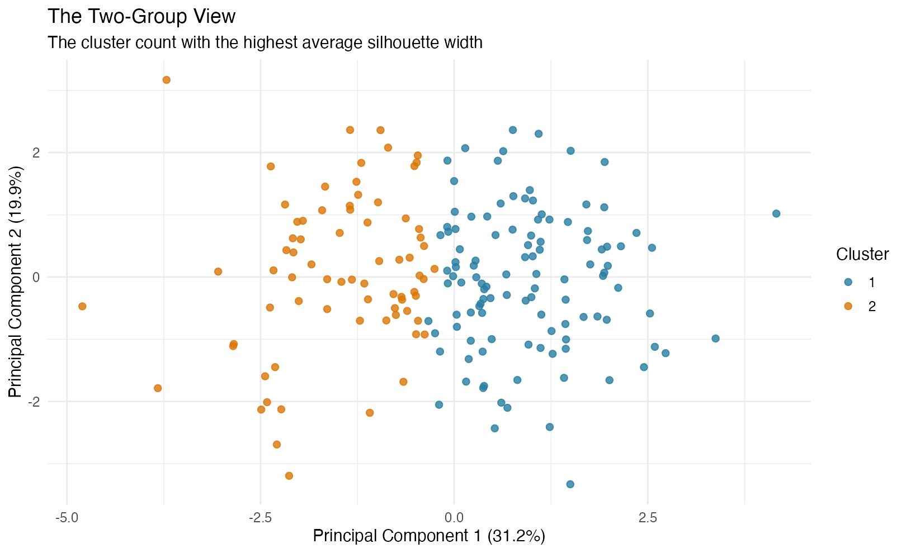
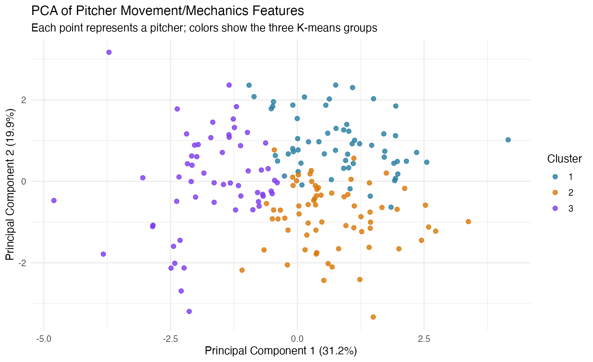
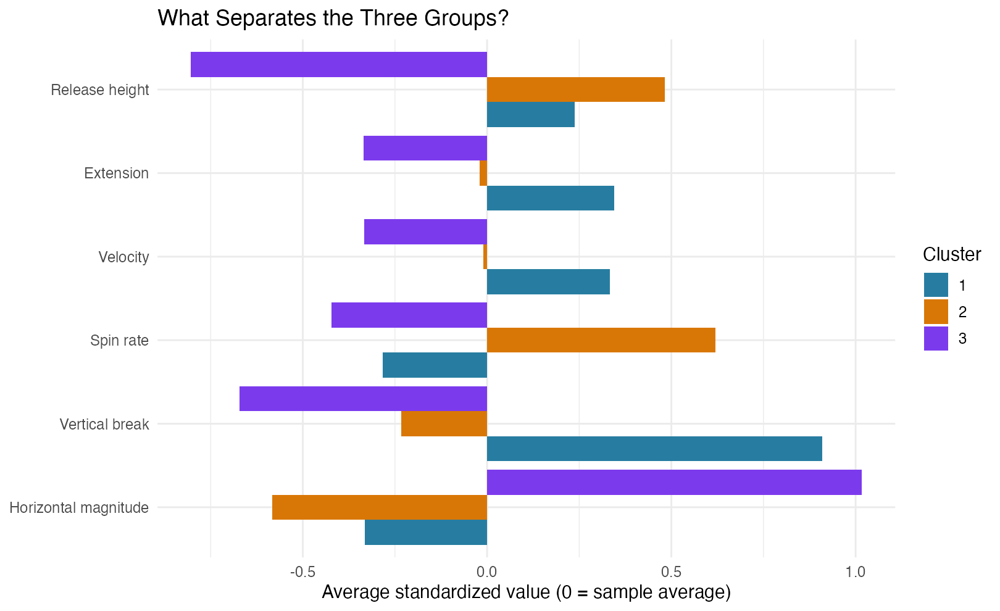
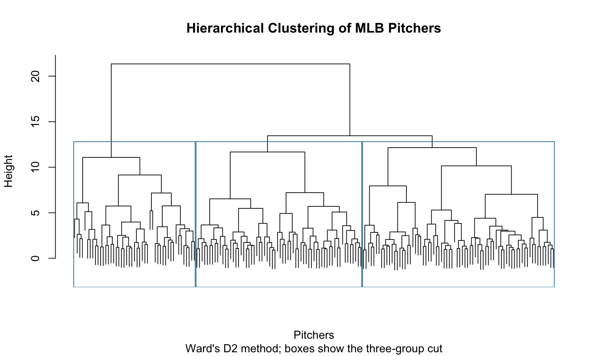
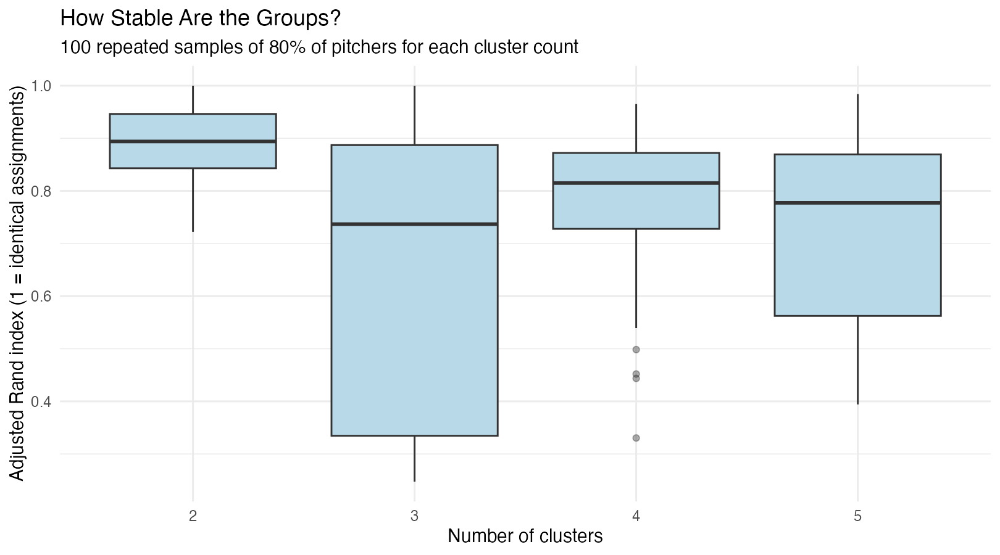
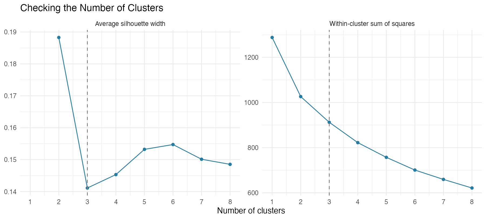

# MLB Pitcher Archetypes

**By Leo Foust**  
**Originally developed:** November–December 2025 · **Updated:** June 2026  
**Tools:** R, Quarto, tidyverse, ggplot2, K-means, hierarchical clustering, PCA

## Overview

Pitchers are often labeled in broad categories such as "sinker-ballers," "power pitchers," etc. However, these labels are often based on subjective observation rather than quantitative definitions. This sparked my research objective: using clustering to explore the pitcher types that emerge across MLB pitchers.

Using data from the 2025 MLB regular season, the goal of this project is to identify groupings of Major League pitchers based on pitch movement, spin characteristics, and release mechanics. This analysis focuses on how pitchers throw the ball, not their performance.

## Research Questions

1. What pitcher types emerge based on pitch movement, spin characteristics, and release mechanics?
2. What physical characteristics define each group?
3. How do the groupings compare between K-means and hierarchical clustering?
4. How much do the groups change when the sample or modeling choices change?

## Results

### Two broad groups, with a three-group view for more detail

The cluster-count checks favored **two groups**, with an average silhouette width of **0.188**, compared with **0.141** for three groups. Larger values indicate better separation. Both scores are low, so the results suggest overlapping profiles rather than sharply separated pitcher types.

The two-group model separates **112 pitchers** with more vertical break and higher release points from **73 pitchers** with more horizontal movement and lower release points.

I kept the three-group view below to describe the profiles in more detail. It is an exploratory summary, and the checks do not establish that there are exactly three natural pitcher types.

### Pitcher groups in two dimensions

The PCA plot compresses the movement, spin, and release measurements into two main dimensions, with each point representing a pitcher and each color showing its K-means cluster. These two dimensions capture **51.1% of the variation** in the features used for clustering. There is separation among the groups, with some overlap. PCA shows the fitted groups; it does not independently validate them.

| Cluster | Pitcher type | Pitchers | Notable examples |
| --- | --- | ---: | --- |
| 1 | Ride-heavy pitchers | 60 | Tarik Skubal, Garrett Crochet, Jacob deGrom |
| 2 | Higher-spin, higher-slot pitchers | 67 | Dylan Cease, Tyler Glasnow, Nick Pivetta |
| 3 | Lower-slot, horizontal-movement pitchers | 58 | Chris Sale, Logan Webb, Framber Valdez |

The examples are selected from the updated model's assignments. The descriptions summarize each group; individual pitchers do not have to match every characteristic. These are movement profiles, not rankings of pitcher quality.

### What separates the three groups?

The first cluster yielded ride-heavy pitchers. Pitchers in this group were characterized by the highest average velocity and induced vertical break, along with the longest release extension.

The second cluster consisted of pitchers with the highest average spin rate and release height. This group had less vertical break than the first group and the lowest average horizontal movement magnitude.

Lower-slot, horizontal-movement pitchers define the third cluster. Pitchers in this group generally had lower velocity, low induced vertical break, but the highest horizontal movement magnitude and the lowest release height.

| Cluster | Velocity (mph) | Spin (rpm) | Vertical break (in.) | Horizontal magnitude (in.) | Release height (ft) | Extension (ft) |
| --- | ---: | ---: | ---: | ---: | ---: | ---: |
| 1 | 90.9 | 2247 | 10.8 | 7.8 | 5.91 | 6.60 |
| 2 | 90.0 | 2450 | 6.9 | 6.9 | 6.02 | 6.46 |
| 3 | 89.1 | 2216 | 5.4 | 12.4 | 5.43 | 6.33 |

These averages describe the pitch types represented in the exports. Horizontal movement is a magnitude here; it does not distinguish arm-side run from glove-side sweep.

### Hierarchical clustering

I also used hierarchical clustering using Ward's method. The finer subclusters indicate that even though pitchers may share pitch movement and mechanical patterns, there are still underlying variations within their respective profiles.

Matching the three-group labels gives **139 of 185 pitchers (75.1%)** in corresponding groups. The adjusted Rand index, which accounts for chance agreement, is **0.406**. The methods overlap, but do not produce the same groups.

| K-means cluster | Hierarchical cluster 1 | Hierarchical cluster 2 | Hierarchical cluster 3 |
| --- | ---: | ---: | ---: |
| 1 | 48 | 0 | 12 |
| 2 | 21 | 1 | 45 |
| 3 | 5 | 46 | 7 |

Cluster numbers are labels, so Cluster 1 in one method does not necessarily correspond to Cluster 1 in the other.

### How stable are the groups?

I repeated the analysis on 100 samples containing 80% of the pitchers for each cluster count. The measurements were scaled again in each sample. Agreement was measured using the adjusted Rand index: 1 means identical assignments, and 0 is the expected value for random partitions.

For three groups, the median agreement was **0.737**, but the 10th percentile was **0.279**. Two groups were more stable. Different random seeds gave identical three-group assignments, but changing which pitchers were included mattered more.

The three-group result was similar at 70% coverage and with at least 1,000 season pitches. It changed more at 90% coverage and when spin direction was removed. These are stability checks, not prediction accuracy.

## Data and Methods

### Data preparation

The data used in this project were sourced from **Baseball Savant**. Four different datasets were downloaded and combined to construct the final dataset used for analysis.

The final dataset includes **185 pitchers** with at least **300 season pitches**, complete measurements, and **80% of their season pitches represented** in the matched spin and movement data. Median coverage was **90.9%**. For each pitcher, weighted averages were computed across the available pitch types, weighted by pitch counts.

The exports do not include every pitch type for every pitcher. I checked coverage against the season totals and used the same complete pitch rows for all weighted averages.

### Spin direction and handedness

The physical measurements were velocity, spin rate, spin direction, induced vertical break, horizontal movement magnitude, release height, and release extension. Spin direction was represented by sine and cosine components so directions near 0 and 360 degrees remain close together. Left-handed directions were reflected around the vertical axis to compare mirror-image deliveries.

The six ordinary measurements were standardized. The two spin components used one shared scale, with a combined variance of one, so spin direction did not receive twice the weight just because it used two columns. Both throwing hands appear in every group. This adjustment addresses the coordinate convention; it does not remove every possible handedness effect.

### Clustering and validation

I compared two through eight clusters using silhouette width and inspected the elbow plot. K-means used 50 random starts, and hierarchical clustering used Ward's method. PCA used the same scaled features as the clustering.

## Takeaways and Limitations

By focusing on the underlying physical characteristics of pitches, this approach to evaluating pitchers can help frame future work in scouting, player development, and game planning. The strongest result is a broad difference between more vertical and more horizontal movement profiles. The three-group view adds detail, but the boundaries are uncertain.

The analysis only contains data from the 2025 MLB regular season; this means the results might not generalize across seasons. Pitch type data were also combined into pitcher level averages, which hides specific pitch traits. This removes the weight of any standout pitches a pitcher might have, such as an outlier fastball or slider.

The coverage requirement reduces missing-arsenal problems but also changes the sample. The clock directions are rounded, horizontal movement is unsigned, and the cluster scores show substantial overlap. Neither the group labels nor the player examples establish matchup advantages or player-development effects.

This could be extended into future work by integrating outcome-based and pitch sequence-based data to see how different profiles perform in various contexts, and by checking whether the groups remain consistent across seasons.

## Code and Data

- [R analysis](R/analysis.R)
- [Pitcher cluster assignments and measurements](reports/pitcher_cluster_assignments.csv)
- [Data sources and methods](docs/data_and_methods.md)
- [Source data](data/)

*Source data remain subject to their providers' terms.*
